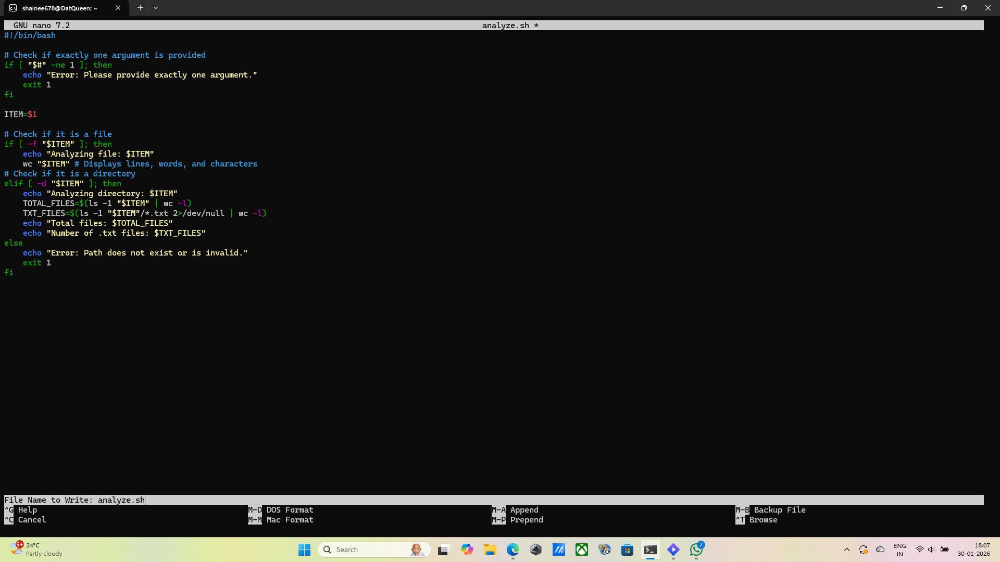
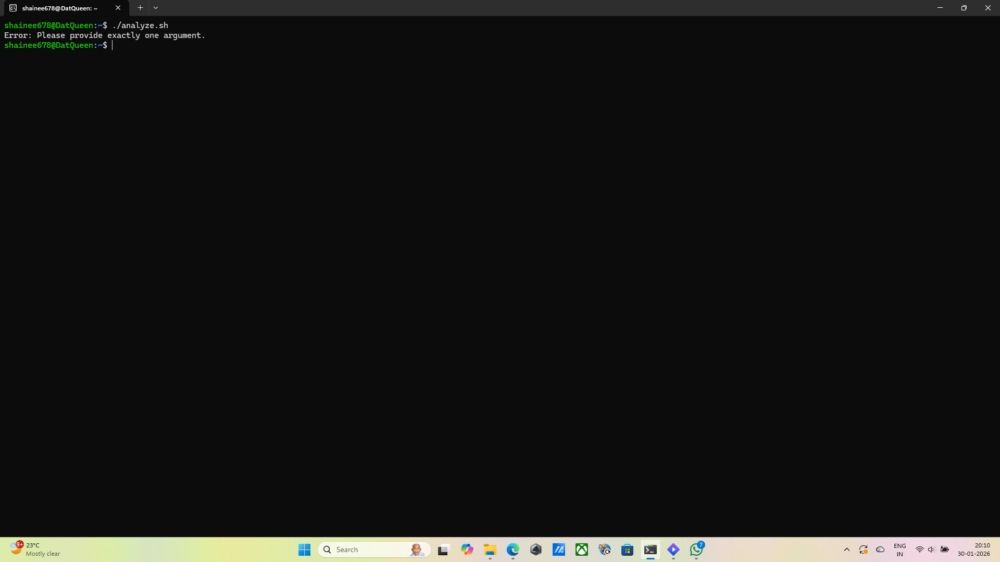
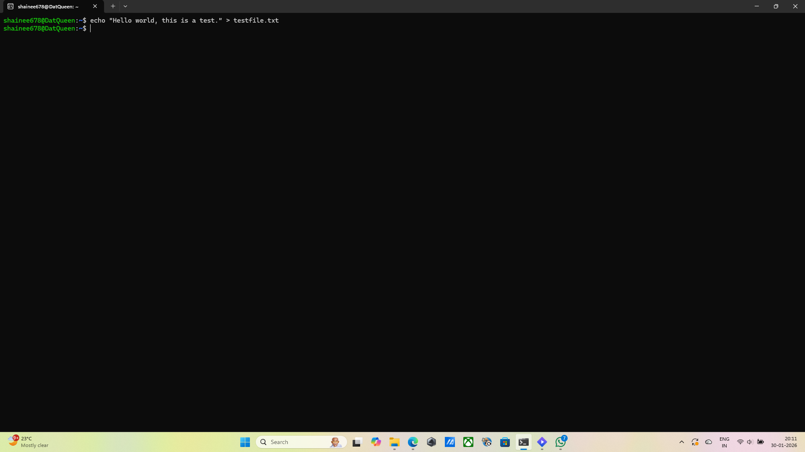
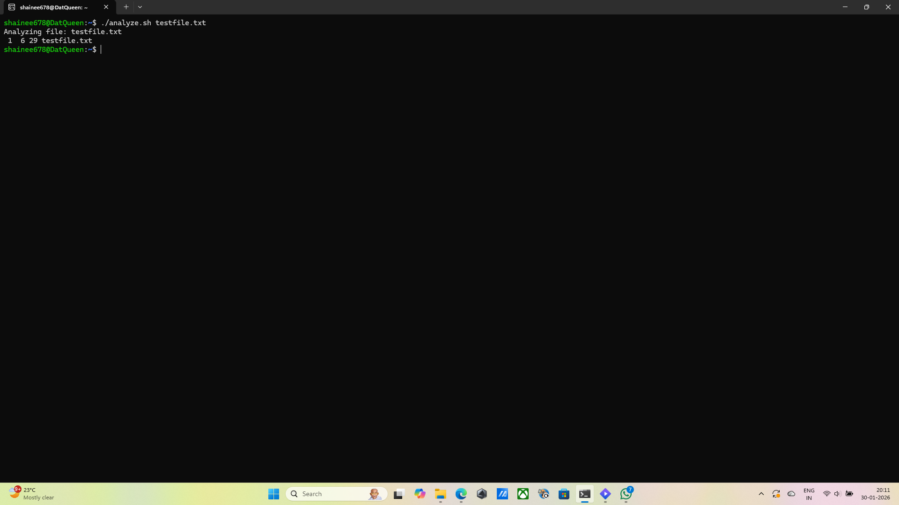
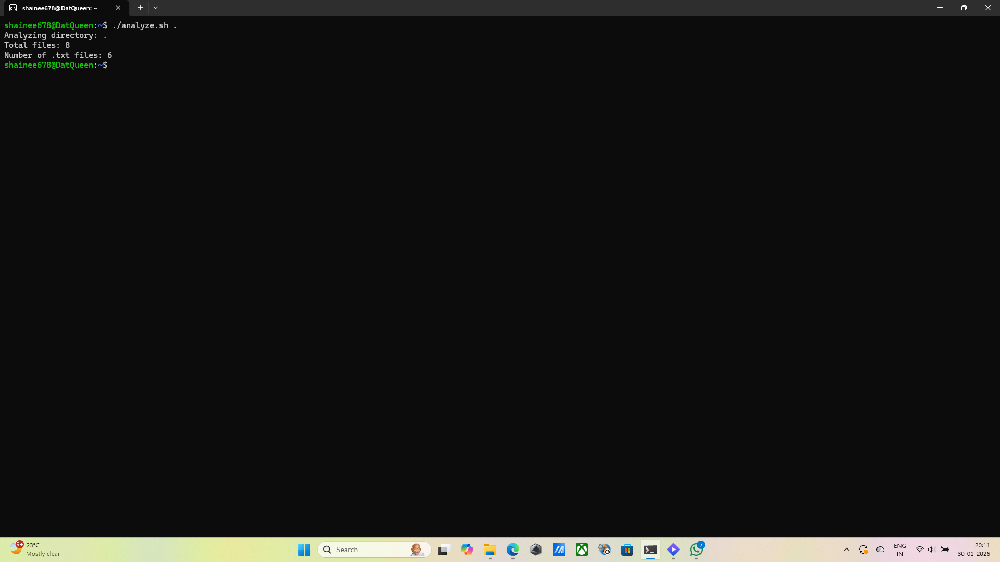

## *Question 1: File and Directory Analysis
## Commands: nano analysize.sh
## Output: nano text editor opened
## Explanation: I use dthis command to open the nano text editor and write the bash script logic required to analyze files and directories.
## Screenshot:  
## Command: chmod +x analyze.sh
## Output: No output
## Explanation: I executed this to change the file permissions, making the script an executable file that the system can run.
## Screenshot: 
## Command: ./analyze.sh
## Output: Error: Please provide exactly one argument.
## Explanation: I ran the script without an argument to test the error handling; it correctly displayed the error message for an invalid argument count.
## Screenshot: 
## Command: echo "Hello world, this is a test." > testfile.txt
## Output: No output
## Explanation: I created a sample text file to verify that the script ccan correctly count lines, words, and characters in a file.
## Screenshot: 
## Command: ./analyze.sh testfile.txt
## Output: Analyzing file: testfile.txt
 1  6 29 testfile.txt
## Explanation: I executed the script with the test file, and it succefully utilized the wc command to display the file's metadata.
## Screenshot: 
## Command: ./analyze.sh .
## Output: Analyzing directory: .
Total files: 8
Number of .txt files: 6
## Explanation: I used the dot argument to test the directory analysis, which correctly counted the total number of files and .txt files in the current path.
## Screenshot: 
