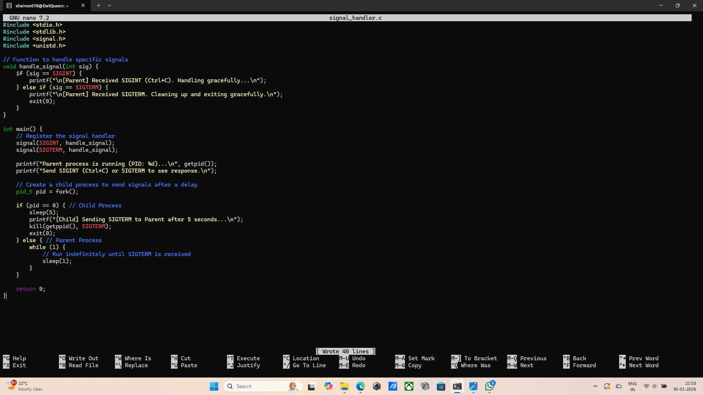
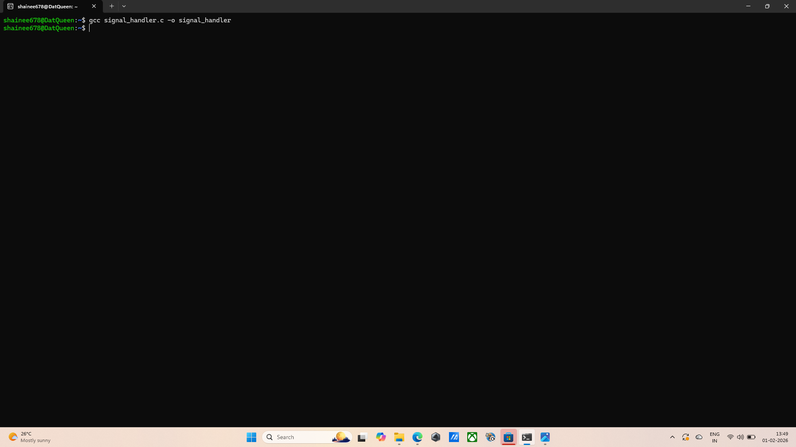
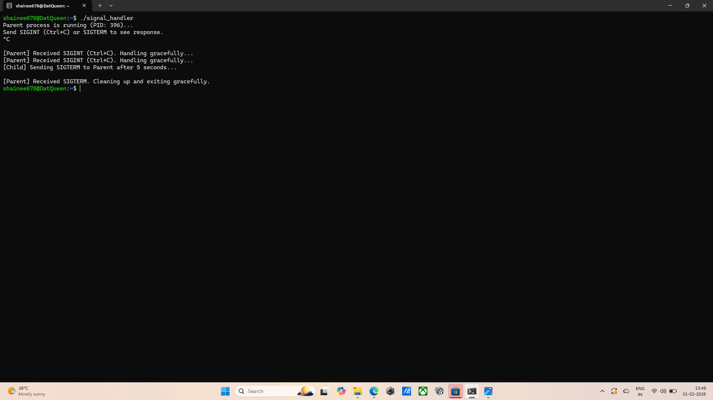

## Question 10: Demonstrating signal handling
## Command: nano signal_handler.c
## Output: The text editor opnened.
## Explanation: This opens the terminal text editor to write the C source code. The program uses the signal() function to let the LInux kernel know to not kill the program when it sees SIGTERM or SIGINT, instead run the handle_signal function. Two child processes are created. In Linux, fork() clones the parent. The return value is used to ensure only the children run the sleep and kill logic. Here, the children use the kill() function to " talk" to the parent process by sending specific signal IDs. The parent process uses exit(0) inside the handler to ensure the program closes cleanly after 5 seconds SIGTERM, only after it acknowledges it received the signal.
## Screenshot: 
## Logic used: fork() for branching, kill() for communication, signal() for interruption, exit(0) for termination.

## Command: gcc signal_handler.c -o signal_handler
## Output: The program compiles succesfuly and the output is empty.
## Explanation: This uses the GNU Compiler Collection to transform human-readable C code into a machine-readable file named signal_handler.
## Screenshot: 

## Command: ./signal_handler
## Output: 
Parent process is running (PID: 396)...
Send SIGINT (Ctrl+C) or SIGTERM to see response.
^C

[Parent] Received SIGINT (Ctrl+C). Handling gracefully...
[Parent] Received SIGINT (Ctrl+C). Handling gracefully...
[Child] Sending SIGTERM to Parent after 5 seconds...

[Parent] Received SIGTERM. Cleaning up and exiting gracefully.
## Explanation: This runs the compiled program. The ./ tells the shell to look in the current directory for the executable. the Cntrl+C sends a SIGINT signal from the keyboard to the runnning process to test the custom handler.
## Screenshot: 

