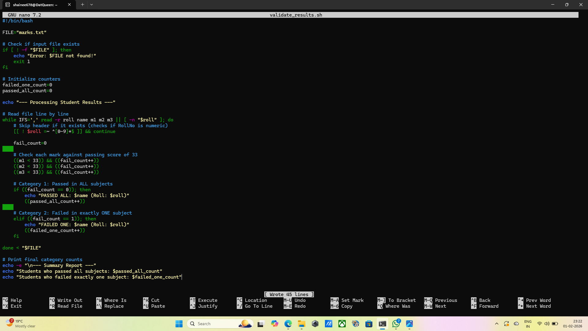
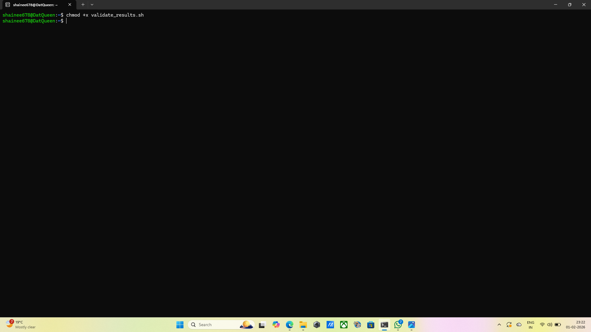
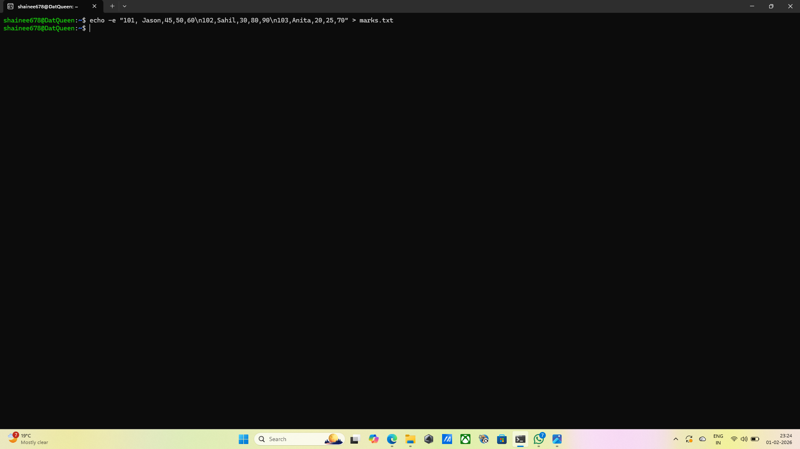

## Question 3: Creating a shell script to process student marks
## Command: nano validate_results.sh
## Output: The nano text editor opens.
## Explanation: This opens up the nano text editor to write the script logic. A while read loop is used to process each line of the marks.txt file one by one. the if and else statements check the marks againt the passing threshold of 33. The script uses double parentheses(( )) to perform ,ath, such as checking if a mark is less that 33 or incrementing a counter for failures. The script checks if the failure count is exactly zero. The script checks if the failure count is exactly one. At the end of the loop, the scripts prints the total number of students in each category.
## Screenshot: 

## Command: chmod +x validate_results.sh
## Output: The terminal returns empty.
## Explanation: This grants execute permissions so the script can run.
## Screenshot: 

## Command: echo -e "101,Jason,45,50,60\n102,Sahil,30,80,90\n103,Anita,20,25,70" > marks.txt
## Output: The terminal retuns empty.
## Explanation: Creates the marks.txt file with sample data(Roll no, Name, Marks1, Marks2, Marks3) for the script to read.
## Screenshot: 

## Command: ./validate_results.sh
## Output: --- Processing Student Results ---
PASSED ALL:  Jason (Roll: 101)
FAILED ONE: Sahil (Roll: 102)

--- Summary Report ---
Students who passed all subjects: 1
Students who failed exactly one subject: 1
## Explanation: This runs the script to process the data and display the results on the screen.
## Screenshot: 
