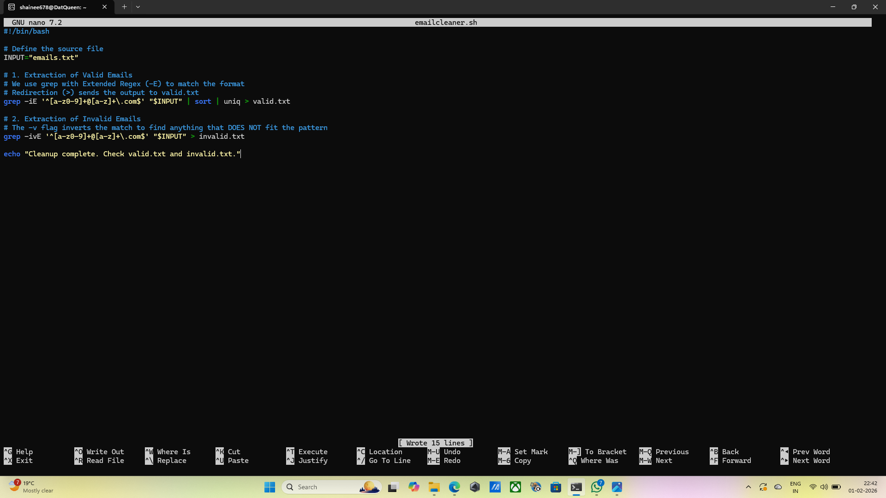
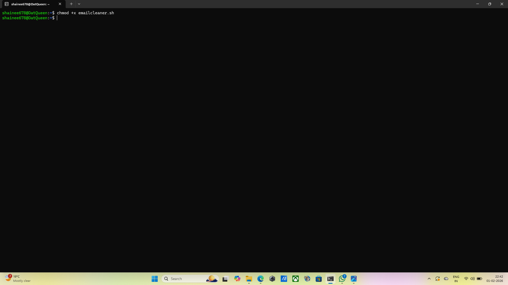
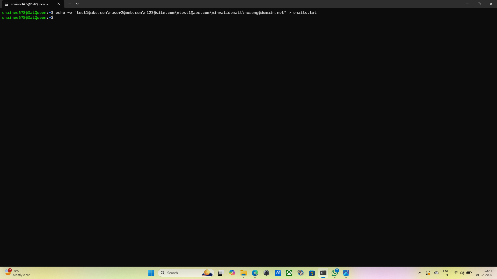
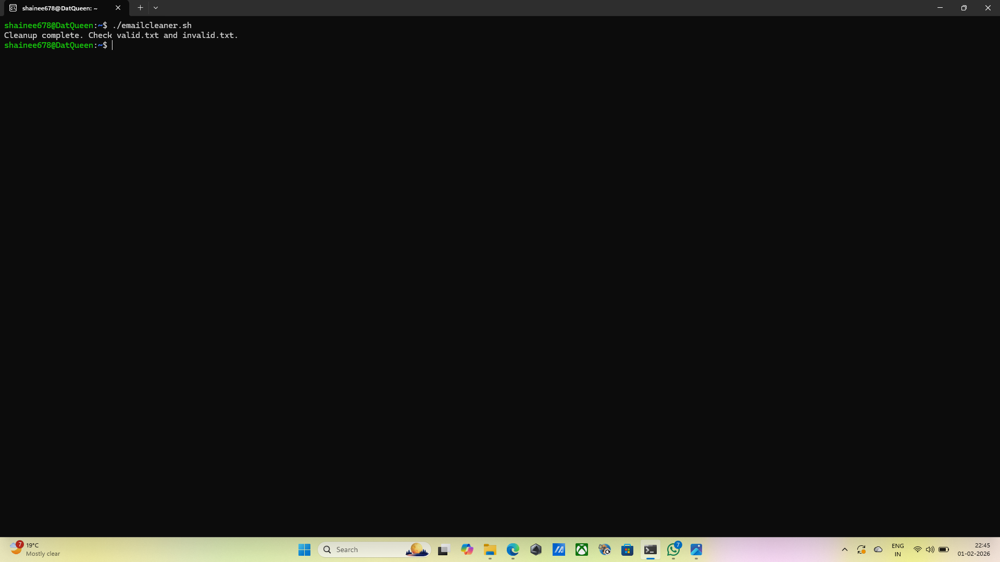
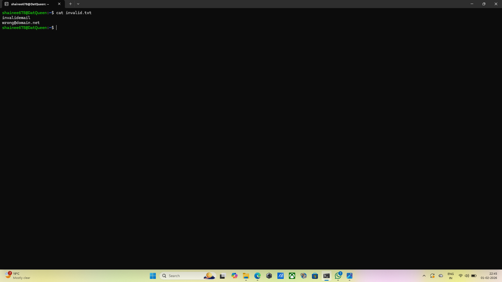

## Question 4: Creating a shell script that processes emails
## Command: nano emailcleaner.sh
## Output: The text editor is opened.
## Explanation: This opens tthe nano text editor to write the script logic. 
grep -iE '^[a-z0-9]+@[a-z]+\.com$': ^ and $ : Anchors that ensures the pattern matches the entire line.
[a-z0-9]+: Matches the "letters and digits" username part.
@[a-z]+\.com: Matches the domain part(letters only) followed by the literal .com.
-i: Makes the check case insenstive.
sort: Arranges the valid emails alphabetically. This is necessary because uniq only removes duplicates that are adjacent to each other.
uniq: Removes the redundant entries so that valid.txt contains only one instance of each address.
> valid.txt: The > operator redirects the cleaned output into a new file.
grep -v: The -v flag is used to find everything that doesn't match the valid pattern and redirect it into invalid.txt.
## Screenshot: 

## Command: chmod +x emailcleaner.sh
## Output: The terminal returns empty.
## Explanation: This grants execute permission so the script can run.
## Screenshot:  

## Command: echo -e "test1@abc.com\nuser2@web.com\n123@site.com\ntest1@abc.com\ninvalidemail\nwrong@domain.net" > emails.txt
## Output: The terminal returns empty.
## Explanation: Creates a test file with valid, invalid, and duplicate entries.
## Screenshot:  

## Command: ./emailcleaner.sh
## Output: Cleanup complete. Check valid.txt and invalid.txt.
## Explanation: This executes the script.
## Screenshot:  

## Command: cat valid.txt
## Output:
          123@site.com
          test1@abc.com
          user2@web.com
## Explanation: This displays the results stored in the redirected output files.
## Screenshot:  

## Command: cat invalid.txt 
## Output: 
          invalidemail
          wrong@domain.net
## Explanation: This displays the results stored in the redirected output files.
## Screenshot:  
