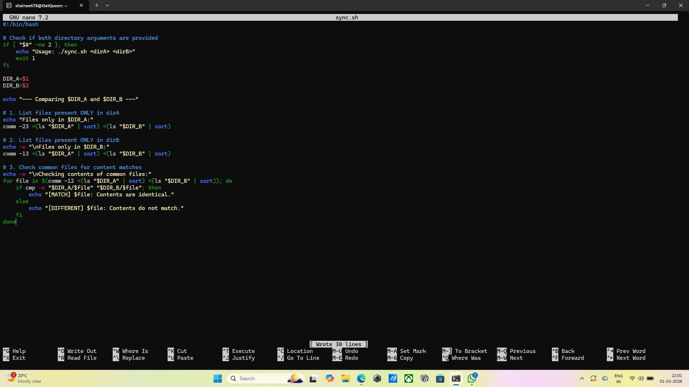
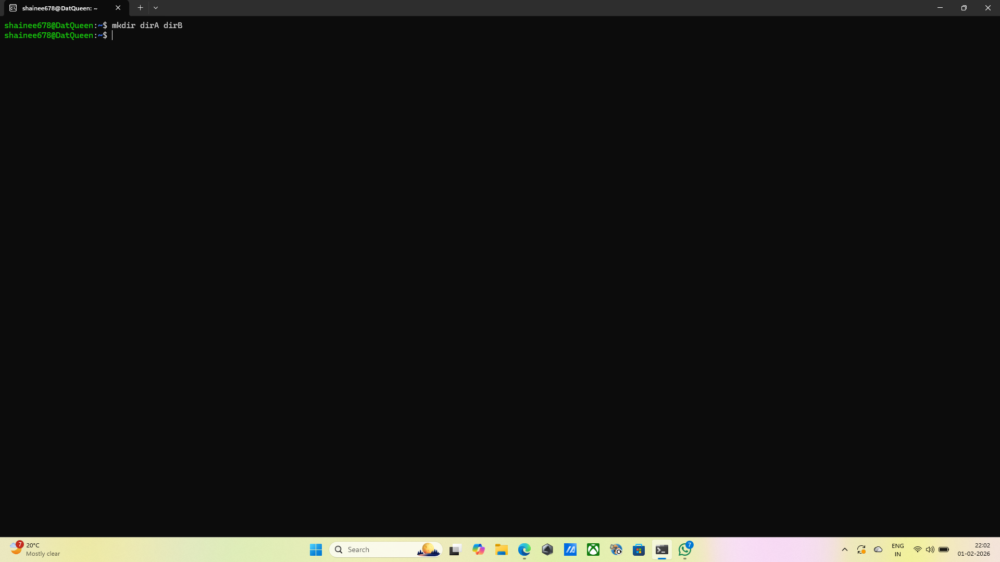
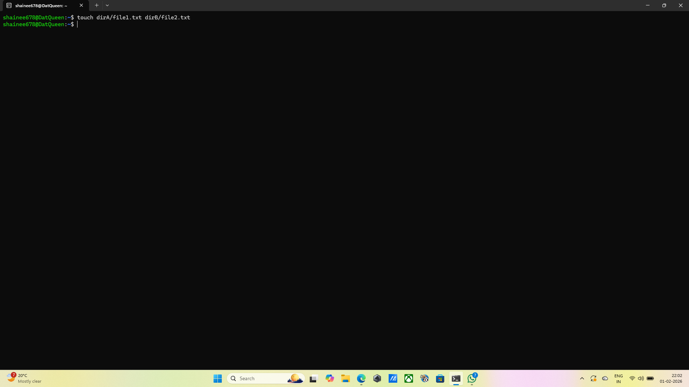
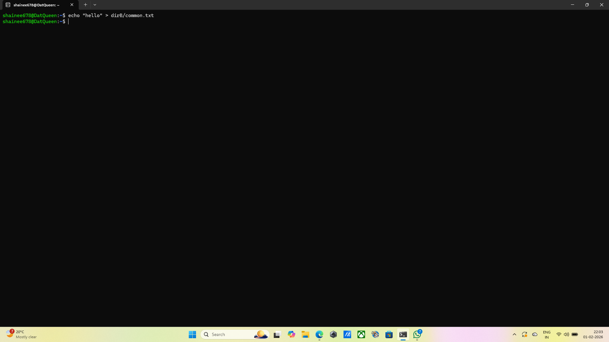
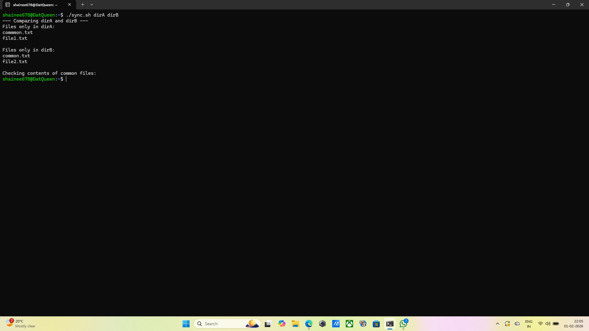

## Question 5: Creating shell script to compare two directories
## Command: nano sync.sh
## Output: The terminal returns empty.
## Explanation: This opens the nano text editor to write the script logic. 
comm: This coommand compares two sorted files line by line.
-23: Suppresses column 2(lines only in file 2) and column 3(common lines), leaving only lines unqiue to file 1.
-13: Suppresses column 1 and 3, leaving only lines unique to file 2.
-12: Suppresses column 1 and 2, leaving only the common files.
cmp -s: Compare two files byte-by byte silently, It returns a "success" exit code if the files are identical, which we use in our if statement.
## Screenshot: 

## Command: mkdir dirA dirB
## Output: The terminal returns empty.
## Explanation: Creates the two folders needed for testing.
## Screenshot: 

## Command: touch dirA/file1.txt dirB/file2.txt
## Output: The terminal returns empty.
## Explanation: Creates unique files in each folder.
## Screenshot: 

## Command: echo "hello" > dirA/common.txt and echo "hello" > dirB/common.txt
## Output: The terminal returns empty.
## Explanation: Creates a file that exists in both with identical content.
## Screenshot: 

## Command: chmod +x sync.sh
## Output: The terminal returns empty.
## Explanation: This grants permissions to the script so it can run.
## Screenshot: 

## Command: ./sync.sh dirA dirB
## Output: --- Comparing dirA and dirB ---
Files only in dirA:
commmon.txt
file1.txt

Files only in dirB:
common.txt
file2.txt

Checking contents of common files:
## Explanation: This runs the script.
## Screenshot: 
