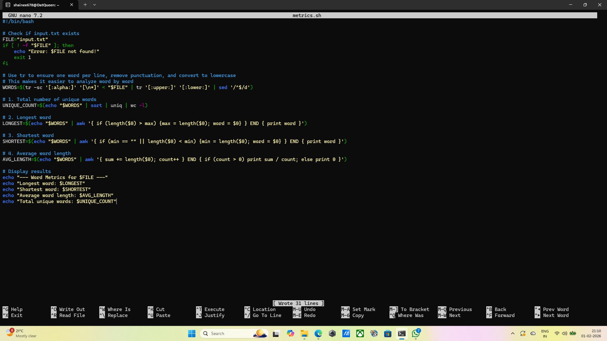

## Question 6: Creating a shell script metrics.sh that analyzes a text file input.txt.
## Command: nano metrics.sh
## Output: The terminal returns empty
## Explanation: This opens the nano text editor to write the script logic. The script uses several pipes and commands:
tr: This is used to "translate" the text. -sc '[:alpha:]' '[\n*]' replaces any non-alphabetic character with a newline, effectively putting every word on its own line for analysis.
sort|uniq|wc -l: sort puts words in order, uniq removes duplicates, wc -l counts the remaining lines to give you the unique word count.
awk: This text-processing tool is used to calculate lengths. For the longest/shortest word, it keeps track of the maximum and minimum string lengths it has seen while scanning the list.
## Screenshot: 

## Command: chmod +x metrics.sh
## Output: the terminal returns empty
## Explanation: Grants execute permissions to the script so it can run.
## Screenshot: 

## Command: echo"Computing is the study of algorithmic processes, computational machines and informaton itself." > input.txt
## Output: the terminal returns empty
## Explanation: Creates the required input file.
## Screenshot: 

## Command: ./metrics.sh
## Output: --- Word Metrics for input.txt ---
Longest word: computational
Shortest word: is
Average word length: 6.83333
Total unique words: 12
## Explanation: This runs the script to display the metrics
## Screenshot: 

