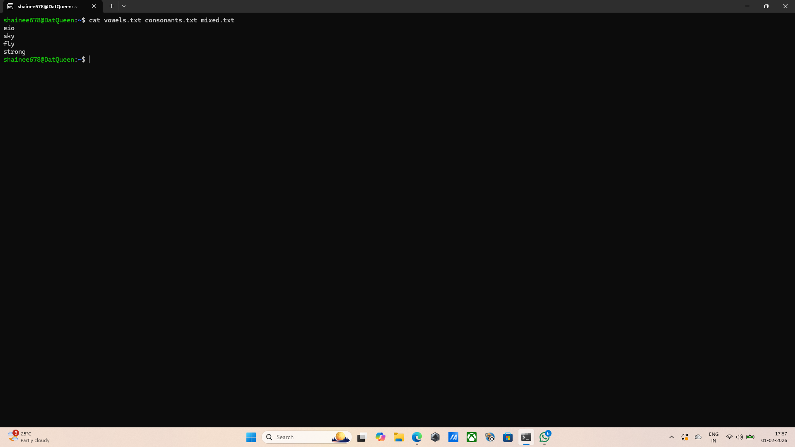

## Question 7: Shell script pattern than reads a textfile
## Command: nano patterns.sh 
## Output: the text editor opens.
## Explanation: This opens the nano text editor to write the script logic. 
grep -iE '^[aeiou]=$' : The -i ignores cases(A vs a). The -E uses extended regular expressions, ^[aeiou]=$ : This looks for lines that start(^) and end($) containing only one or more(+) vowels. 
grep -vE '[aeiou]': -v: Invert match(shows lines that do not contain the pattern), [aeioi]: Any line that doesn't have a single vowel is, by definition, "consonants only".
grep -iE '^[^aeiou].*[aeiou]' : ^[^aeiou] : This starts with something that is not a vowel( a consonant), .*[aeiou] : contains at least one vowel later in the word.
## Screenshot: 

## Command: chmod +x patterns.sh
## Output: the terminal returns empty
## Explanation: Changes the file permissions to make the script "executable", Without this, the program cannot run.
## Screenshot:  

## Command: echo -e "area\nsky\napple\nfly\neio\nstrong" > input.txt
## Output: the terminal returns empty
## Explanation: Creates a sample input file containing words that fit all three categories(vowels only, consonants only, and mixed).
## Screenshot:  

## Command: ./patterns.sh input.txt
## Output: Processing complete. Results saved in vowels.txt, consonants.txt and mixed.txt.
## Explanation: Runs the script using input.txt as the data source.
## Screenshot:  

## Command: cat vowels.txt consonants.txt mixed.txt
## Output: eio
           sky
           fly
           strong
## Explanation: Displays the contents of the generated files to verify the logic worked.
## Screenshot: 
