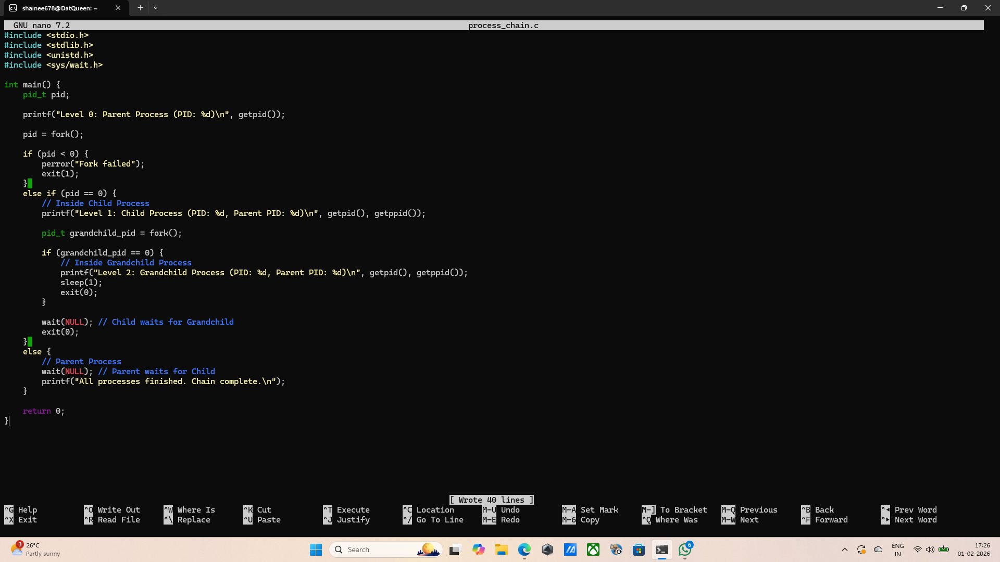
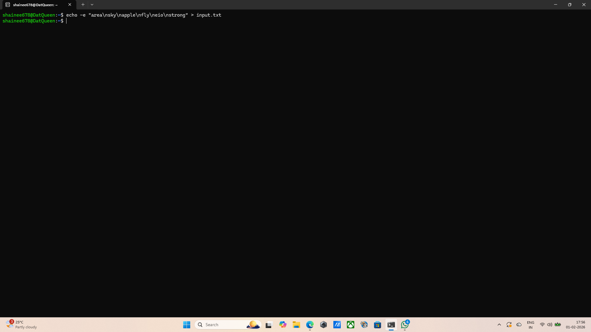
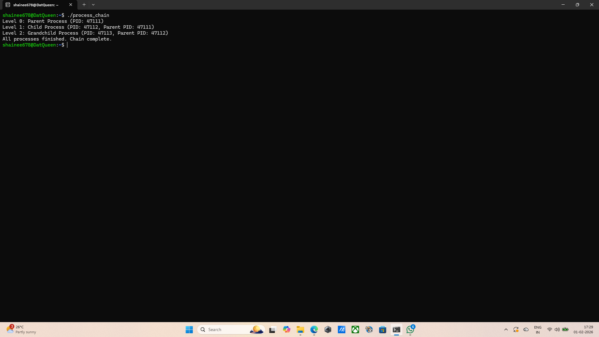
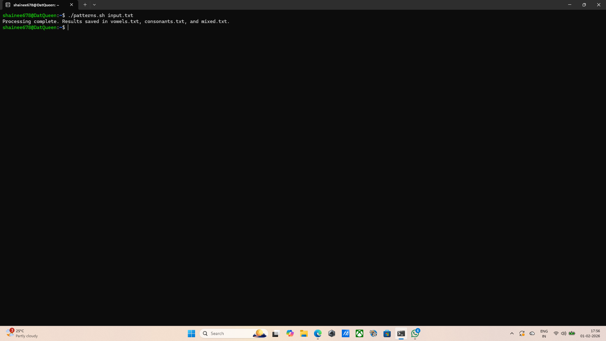

## Question 7: Demonstrating Process Hierarchy 
## Command: nano process_chain.c 
## Output: the text editor opens.
## Explanation: This opens the nano text editor to write the C source code that handles the nested fork() logic. A chain is created by calling fork() inside the child's logic. This makes the first child a "parent" to the next process(the grandchild). Each process has a unique PID. By printing the PPID, the hierarchy is proven. The grandchild's PPID matches the child's PID. The child's PPID matches the parent's PID. the parent uses the wait() to stay alive until its child finishes. This prevents "orphaned" processes and ensures the output prints in the correct order.
## Screenshot: 

## Command: gcc process_chain.c -o process_chain
## Output: terminal returns empty, the progra is compiiled succesfully.
## Explanation: Uses the GCC compiler to turn the code into a runnable binary file named process_chain.
## Screenshot:  

## Command: ./process_chain
## Output: Level 0: Parent Process (PID: 47111)
Level 1: Child Process (PID: 47112, Parent PID: 47111)
Level 2: Grandchild Process (PID: 47113, Parent PID: 47112)
All processes finished. Chain complete.
## Explanation: This executed the proram. The three distinct lines of the output represents the three levels of the process chain.
## Screenshot:  

## Command: pstree -p
## Output: systemd(1)─┬─agetty(212)
           ├─agetty(218)
           ├─cron(185)
           ├─dbus-daemon(186)
           ├─init-systemd(Ub(2)─┬─SessionLeader(327)───Relay(334)(329)───bash(334)───pstree(46973)
           │                    ├─init(6)───{init}(7)
           │                    ├─login(336)───bash(371)
           │                    └─{init-systemd(Ub}(8)
           ├─polkitd(9132)─┬─{polkitd}(9134)
           │               ├─{polkitd}(9135)
           │               └─{polkitd}(9136)
           ├─rsyslogd(215)─┬─{rsyslogd}(233)
           │               ├─{rsyslogd}(234)
           │               └─{rsyslogd}(235)
           ├─systemd(343)───(sd-pam)(344)
           ├─systemd-journal(58)
           ├─systemd-logind(193)
           ├─systemd-resolve(118)
           ├─systemd-timesyn(127)───{systemd-timesyn}(180)
           ├─systemd-udevd(103)
           └─unattended-upgr(222)───{unattended-upgr}(271)
## Explanation: This checks the process tree, to see the visual hierarchy.
## Screenshot:  
