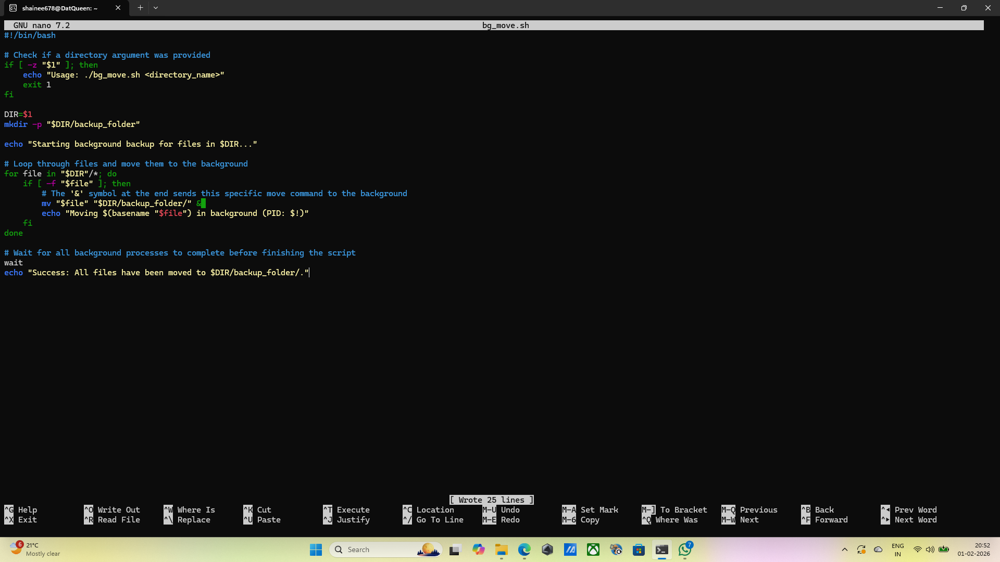
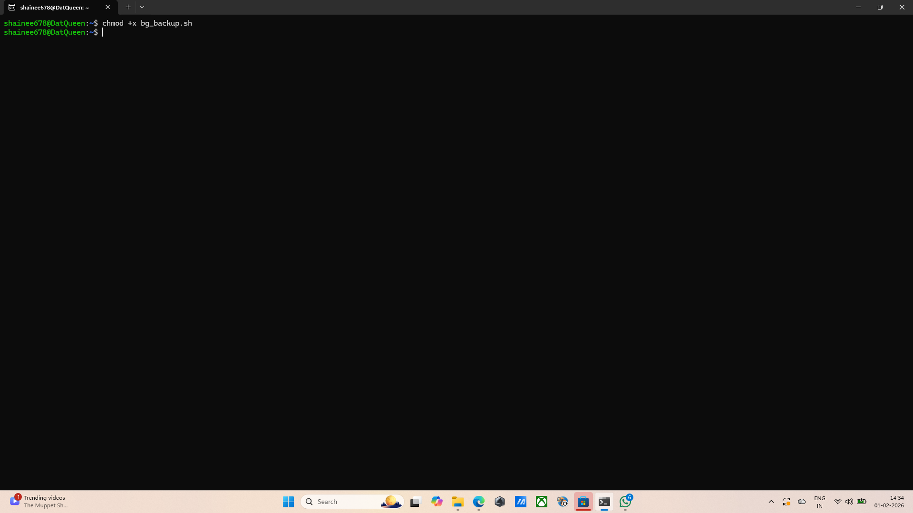
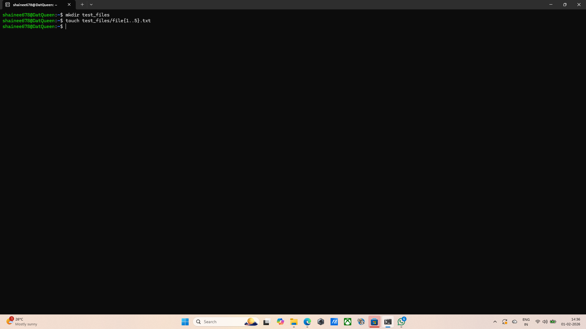
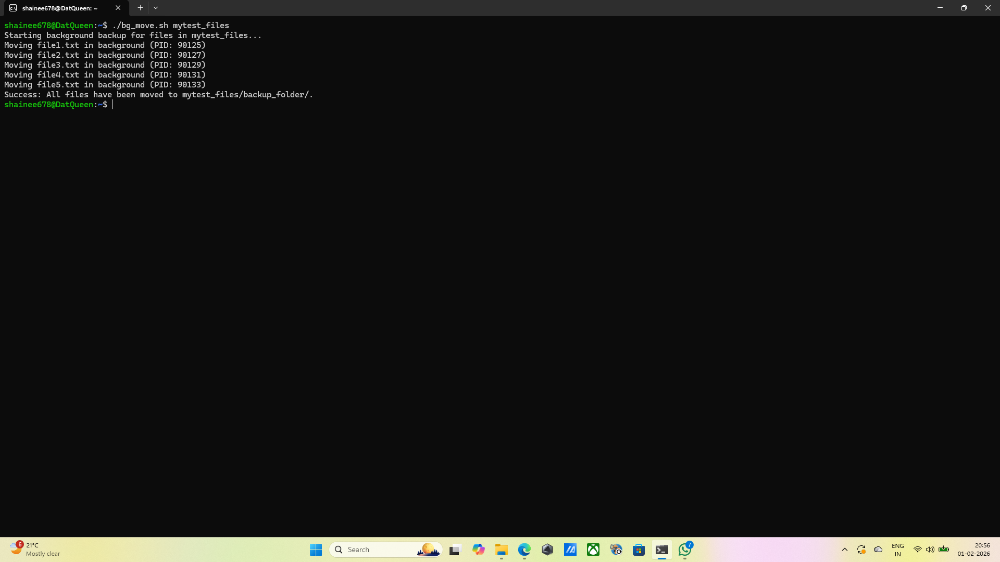
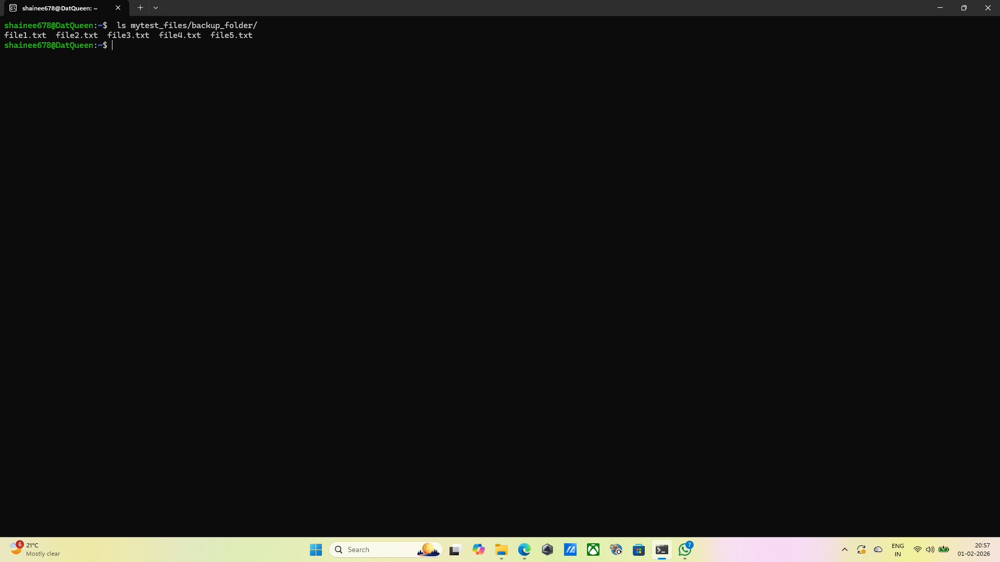

## Question 8: Bckground Processes
## Command: nano bg_move.sh
## Output: the text editor opened.
## Explanation: This opens the nano text editor to write the script logic that handles the moving of files. Inside the script logic is, mv "$file" "$DIR/backup_folder/" &, The ampersand(&) is the most important part as it tells the system to run the mv(move) command in the background. $! This special shell variable captures the PID of the last background process. the wait command forces the parent script to stop and wait until all background move processes are finished before printing the "Success" message.
## Screenshot: 

## Command: chmod +x bg_move.sh
## Output: No output, terminal returns empty
## Explanation: This command changes the file permissions to allow the script to run as a program.
## Screenshot: 

## Command: mkdir mytest_files
## Output: terminal returns empty
## Explanation: Creates a new directory named test_files to hold the items we want to move.
## Screenshot: 

## Command: touch mytest_files/file{1..5}.txt
## Output: terminal returns empty
## Explanation: This uses brace expansion to quickly create 5 emptyfiles( file1.txt through file5.txt) inside the folder for the script to process. 
## Screenshot: 

## Command: ./bg_move.sh mytest_files
## Output: Starting background backup for files in mytest_files...
Moving file1.txt in background (PID: 90125)
Moving file2.txt in background (PID: 90127)
Moving file3.txt in background (PID: 90129)
Moving file4.txt in background (PID: 90131)
Moving file5.txt in background (PID: 90133)
Success: All files have been moved to mytest_files/backup_folder/.
## Explanation: This executes the script and passes test_files as an argument(represented as $1 inside the script).
## Screenshot: 

## Command: ls mytest_files/backup_folder/
## Output: file1.txt  file2.txt  file3.txt  file4.txt  file5.txt
## Explanation: Lists the contents of the new backup directory. All 5 files are seen, thus the background process was successful.
## Screenshot: 
