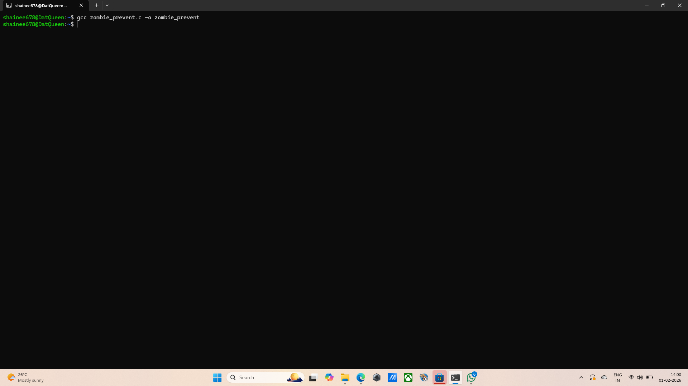
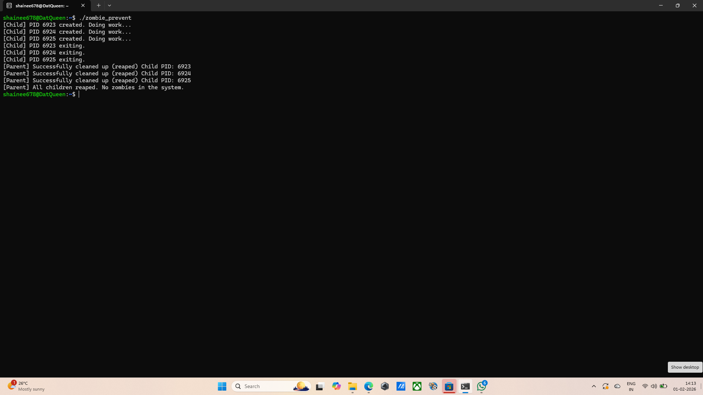

##   Question 9: Demonstrating zombie process prevention
## Command: nano zombie_prevent.c
## Output: The text editor opened.
## Explanation: This opened the nano text editor to write the C source code for the zombie prevention logic. When a child process finishes using exit(), it doesn't disappear immediately, it stays in a "zombie" state so the parent can read its exit status. If the parent never checks on the child, the zombie stays in the system's process table, wasting memory and PID slots. The wait() command is used by the parent to "reap" the child. This action collects the child's exit status and allows the Linux kernel to fully remove the process from the system. By using a loop to call wait() for every fork(), it is exnsured that every child created is accounted for and cleaned up.
## Screenshot: 
## Logic used: fork(), wait(), exit()

## Command: gcc zombie_prevent.c -o zombie_prevent
## Output: The terminal returns empty, the program is compiled succesfully.
## Explanation: This command compiled the C file into an executable binary called zombie_prevent.
## Screenshot: 

## Command: ./zombie_prevent
## Output: [Child] PID 6923 created. Doing work...
[Child] PID 6924 created. Doing work...
[Child] PID 6925 created. Doing work...
[Child] PID 6923 exiting.
[Child] PID 6924 exiting.
[Child] PID 6925 exiting.
[Parent] Successfully cleaned up (reaped) Child PID: 6923
[Parent] Successfully cleaned up (reaped) Child PID: 6924
[Parent] Successfully cleaned up (reaped) Child PID: 6925
[Parent] All children reaped. No zombies in the system.

## Explanation: This command runs the program to demonstrate the creation and subsequent cleanup of multiple child processes.
## Screenshot: 
